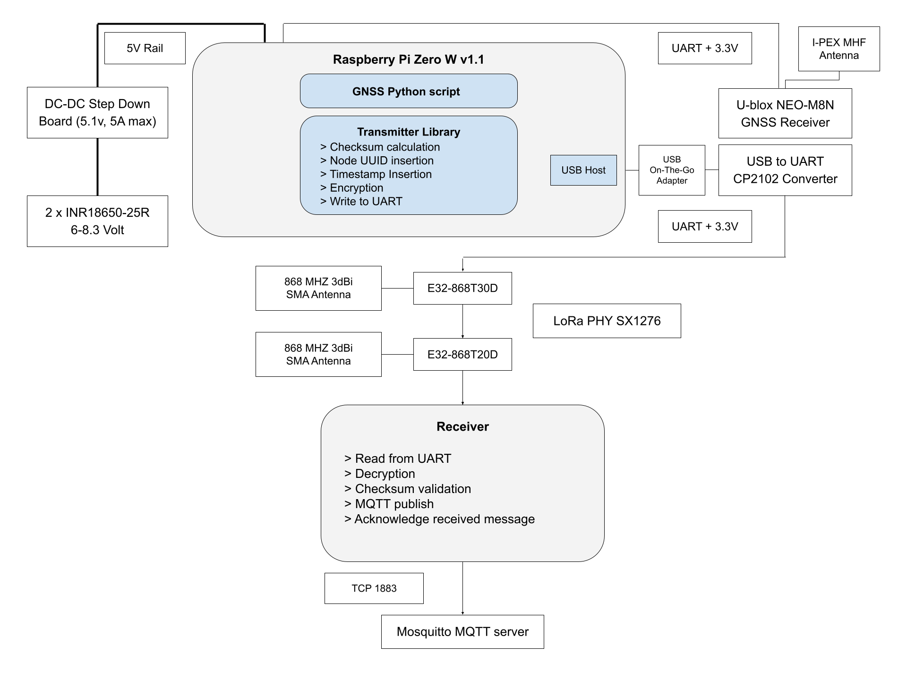
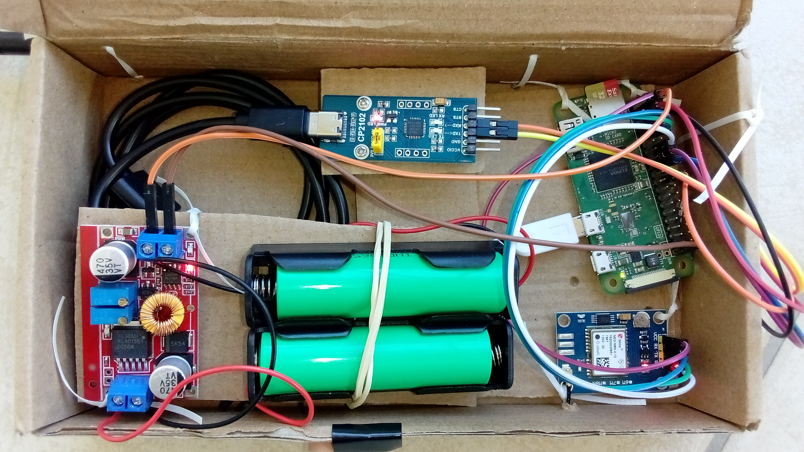
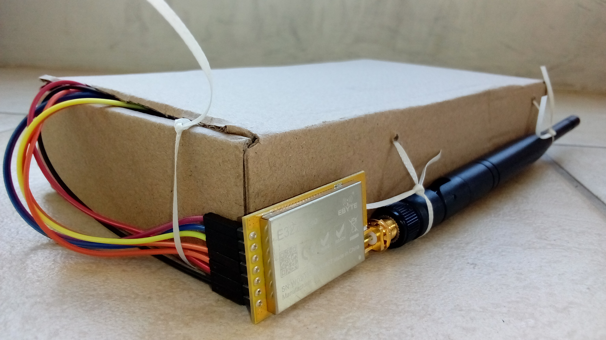
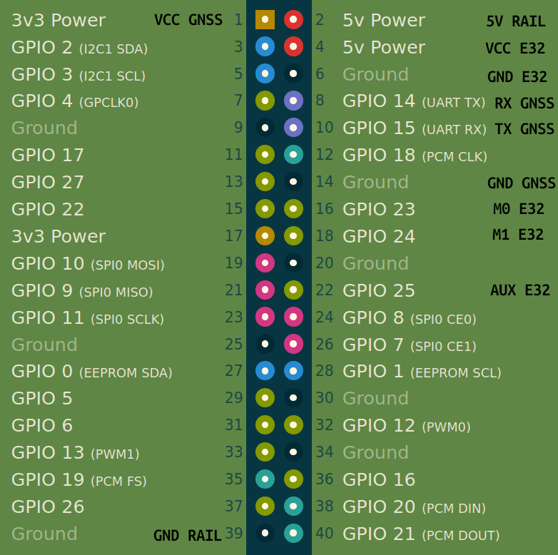

### LoRa network range evaluation using a mobile Raspberry Pi Zero configuration, equiped with a GNSS module

System configured with a headless Raspberry Pi Zero, transmitting its location to a LoRa p2plink base station. Used for testing wireless range capabilities in urban and open area locations.

#### Features

* 2x18650 cells
* XL4015 Voltage Regulator feeding 5.1v to GPIO 5v Power pins
* U-Blox NEO-M8N GNSS
* Second CP2102 UART interface
* E32-868-T30D LoRa tranceiver

#### System Diagram

#### Box configuration

#### Raspberry Pi Zero GPIO Pinout

