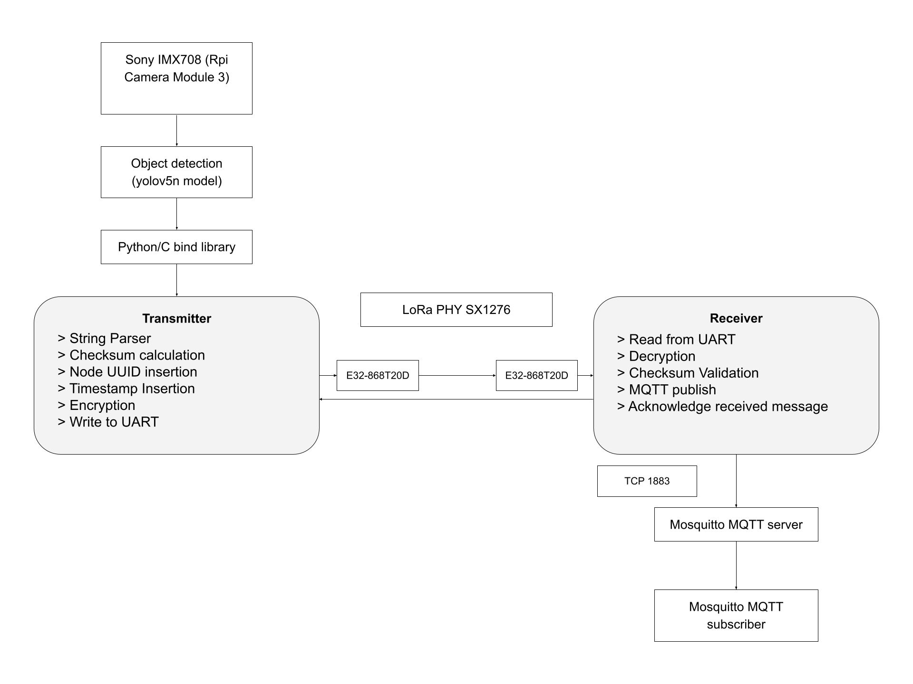
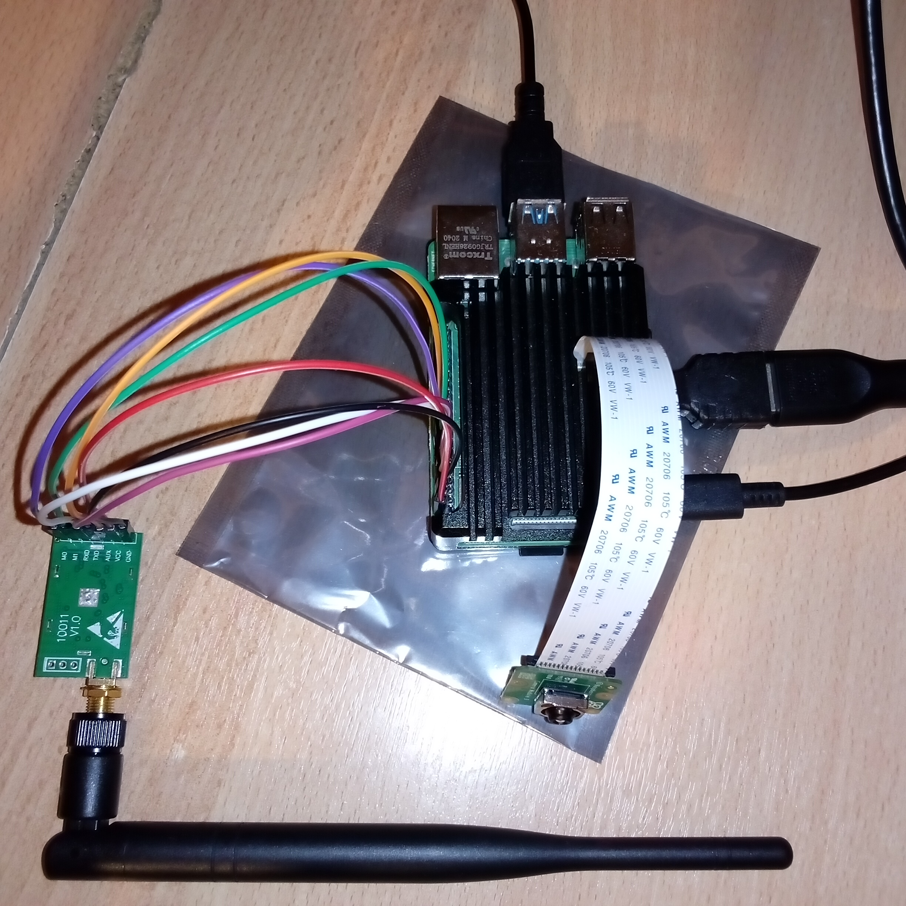
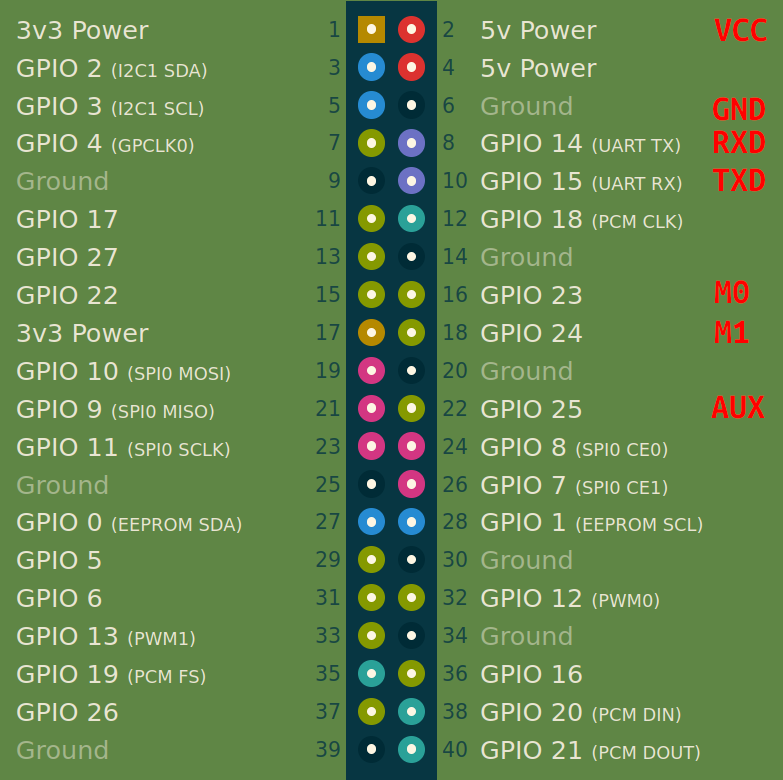

### LoRa network layer for Peer to Peer messaging and command delivering

#### Requirements: 
* libmosquitto-dev
* uuid-dev
* libssl-dev

#### Features

* Receiver and Transmitter functionality
* UART LoRa interface
* Error detection with embedded checksum
* OpenSSL EVP based encryption
* Message acknowledgement
* MQTT message forwarding

#### System Diagram



#### Raspberry Pi 4 Model B + Sony IMX708 (Rpi Camera Module 3) + Ebyte E32-868T20D



#### Ebyte E32-868T30D <--> Raspberry Pi Pinout



#### Examples:

Send JSON message using serial0 interface:
```
./lrd -t /dev/serial0 -s "message"
```
Encrypt and send JSON message:
```
./lrd -t /dev/serial0 -e -s "message"
```

Receive JSON message using ttyUSB0 interface:
```
./lrd -t /dev/ttyUSB0 -r
```

Receive encrypted JSON message:
```
./lrd -t /dev/ttyUSB0 -e -r
```

Receive broadcasted messages from MQTT:
```
mosquitto_sub -h hostname -u username -P password -t "lrdlink"
```
